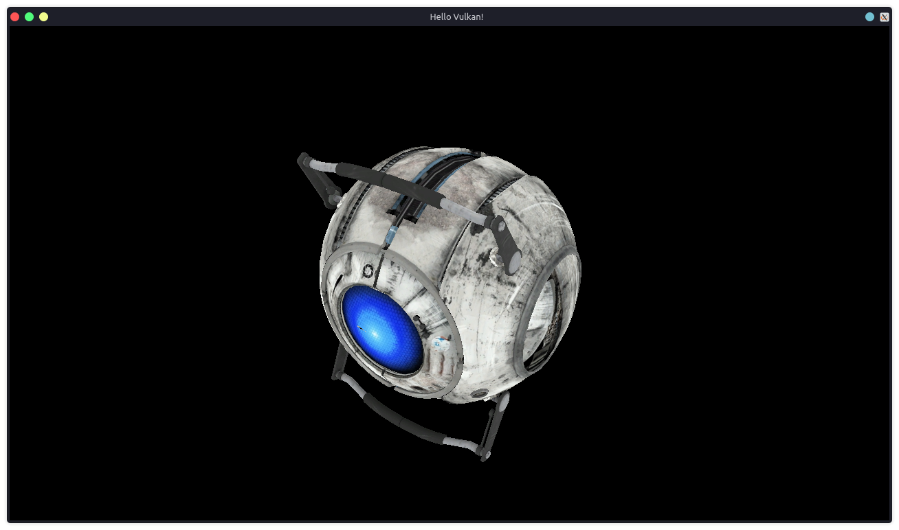

# Vulkan Triangle Draw Example

This is an example of a Vulkan Application in C++, based on my previous [Vulkan Triangle Example](https://github.com/Azrielx86/VulkanTriangle)

## How to execute it

You may need the VulkanSDK tools, if you are using Linux, check your distro repository list.

I had to install this packages on Gentoo:

```
dev-util/vulkan-headers-1.3.268
dev-util/vulkan-tools-1.3.268
dev-util/vulkan-utility-libraries-1.3.268
media-libs/vulkan-layers-1.3.268
media-libs/vulkan-loader-1.3.268
media-libs/glfw-3.3.8
media-libs/shaderc
```

Also you need Boost library for `boost::format`

To use it on Windows, you can download the LunarG VulkanSDK from [here](https://vulkan.lunarg.com/#new_tab), GLFW and Boost are avaiable at vcpkg.

# Result



> Model link [here](https://sketchfab.com/3d-models/wheatley-core-from-portal-2-original-c1bdc8523a8849bd81d6aa901daa409f)
